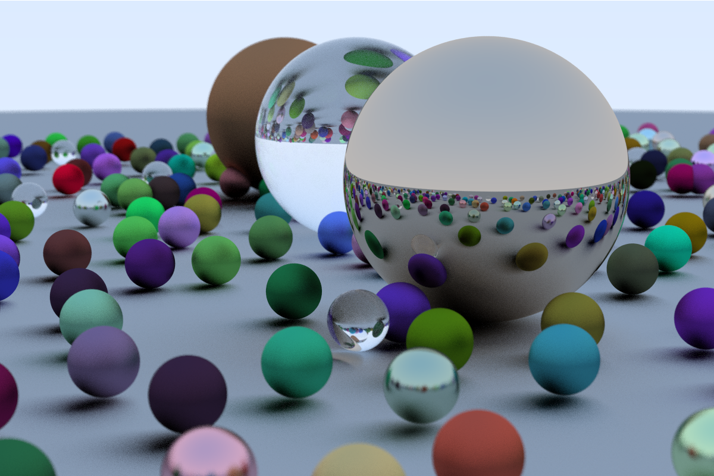

# Go Raytracing in One Weekend

This is an implementation of [Ray Tracing in One Weekend - The Book Series](https://raytracing.github.io/) using Go and [go-glm](https://github.com/engoengine/glm).

As I am learning Go, I decided to translate the book's C++ implementation to Go. The objective is to compare both implementations, trying firstly to accomplish each chapter's objectives, and secondly trying to optimize the result.

The current status of the code is shown below:

| Chapter           | Result                  |
| :---------------: | :---------------------: |
| Book 1 Complete   |    |

As stated in the book, Ray Tracing in One Weekend does not aim to create a complete ray tracer (more of a path tracer). The following books add more functionalities to the ray tracer, making it feature complete by the end of the series.

